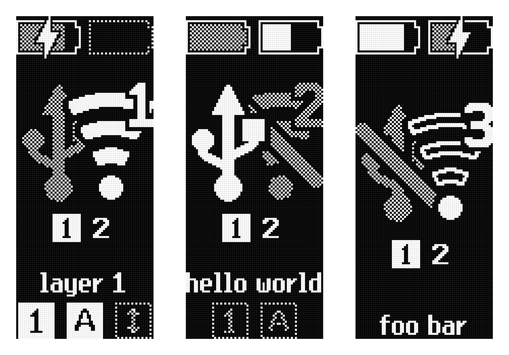

# A [ZMK] module for a custom [nice!view] display

Wireless keyboards are great but sometimes one may find themselves wondering
_"is this thing connected?"_,
_"where is it typing to?"_,
_"is it even on?"_,
_"does it need charging?"_

This custom display attempts to answer these questions by showing essential status information at a glance.

Icons have been hand-crafted pixel by pixel and the text is renderer using a customized version of the [Terminus font][terminus-font].

[ZMK]: https://zmk.dev/
[nice!view]: https://nicekeyboards.com/nice-view/
[terminus-font]: https://terminus-font.sourceforge.net/
